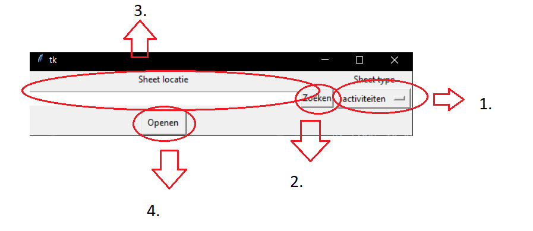
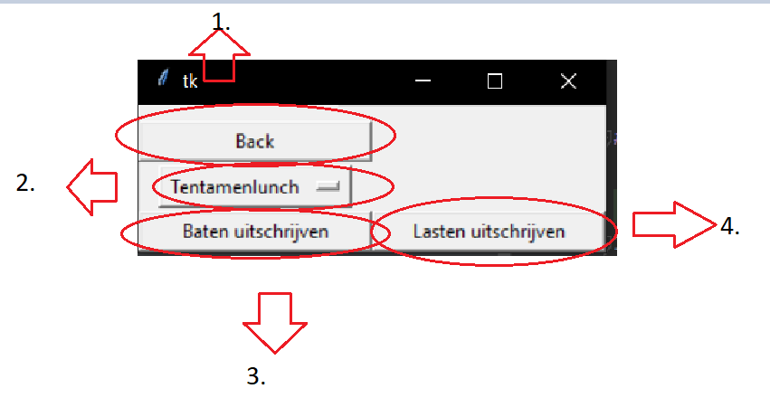

# Accountview_Typer

AV_Typer is een python tool om makkelijk excel data over te typen naar Accountview

## Installation
Installatie is erg eenvoudig. Download AV_Typer.zip en pak het uit. Zoek vervolgens in de map AV_Typer.exe en voer dit bestand uit. Het programma zou dan moeten opstarten
## Usage


1. *Type selectie:* Elke sheet (dus activiteiten, weekend en borrel) heeft een aparte indeling in excel. Om deze reden moet je bij het openen aangeven om welk type sheet het gaat. Als je de verkeerde sheet aangeeft werkt de tool niet, dus check dit eerst voordat je een bug report indiend!
2. *Zoeken:* Door op deze knop te drukken kan je een bestand op je laptop zoeken
3. *Locatie:* Hier komt de locatie van het geselecteerde excel workbook te staan. Je kan hier ook een locatie in typen/plakken
4. *openen:* Zodra je een workbook hebt geselcteerd kan je hierop drukken om naar de typsheet te gaan.


1. *Terug:* gebruik dit om een andere workbook te selecteren
2. *sheet selectie:* Gebruik dit om de sheet die je wilt uittypen te selecteren
3. *Baten uitschrijven:* Druk op deze knop om de baten uit de sheet uit te schrijven. De tool begint niet direct met typen maar wacht tot je op ',' drukt. De tool mag niet geminimaliseerd zijn als je dit doet. Je kan het typen op elk moment stoppen door op 'left-control' te drukken.
4. *Lasten uitschrijven:* Druk op deze knop om de lasten uit te schrijven. Voor meer infor zie baten

## Sheet types
Er zijn 4 sheet types
1. Activiteiten voor activiteitensheets
2. borrel voor borrel sheets
3. weekend voor weekend sheets
4. simpel voor sheets volgens een vast formaat. de contributie sheet werkt hier bijvoorbeeld ook mee.

## Verschil V1 en V2
V2 bied support voor de nieuwe activiteiten sheet (die die begint op regel 4 ipv 1, net zoals de andere sheets), en heeft een fix voor bugs waar het grootboek als float werd gezien (aka een .0 achteraan werd gezet.). Verder worden bijdragen van BP bij activiteiten sheets nu wel toegvoegd. V2 is zo mogelijk nog slechter getest dan V1 dus laat vooral weten als er iets kapot is.

## Known Bugs
### V1
- Werkt niet meer met de huidige activiteiten sheet.
- Grootboek wordt soms .0 achter gezet
- Bijdrage van BP wordt bij activiteiten sheet niet toegevoegd.
- Bijhouden van de weekendsubsidie is niet correct
### V2
- Simpel sheet settings voor contributie e.d. spuugt geen text uit in de terminal. Het werkt wel (zolang je baten gebruikt).
- Als je voorschoten op de zelfde doc-fac zet moet je in AV twee keer op enter drukken. Er is geen robuste manier om dit in de typer mee te nemen, ik zou voorschoten dus vooral gewoon op de debiteurenstand zetten.

## memo aan mezelf
build-command is: `pyinstaller --add-data 'src/__conf__.ini;.' ./src/AV_Typer.py`

## License
[MIT](https://choosealicense.com/licenses/mit/)

### Some more documentation

# **Controller Class Documentation**

The `Controller` class serves as the central orchestrator of the interaction between the UI, data input/output operations, and background processing threads. It integrates various components, such as file handling, reading, and writing data to Excel files while managing different application scenes.

---

### **Dependencies**
- **Standard Libraries**: 
  - `threading`: for handling concurrent tasks, such as data writing in the background.
  - `os.path`: for file path manipulations.
- **Third-party Libraries**:
  - `ConfigParser`: for reading configuration data from an `.ini` file.
- **Project Modules**:
  - `Reader`, `Writer`: custom classes handling data reading and writing.
  - `FileBuilder`: for building and managing file objects.
  - `Scene`, `SceneType`: for managing user interface (UI) scenes.
  - `resource_path`: utility for handling resource paths.

---

### **Attributes**
1. **`writer`**: 
   - Instance of the `Writer` class. Handles the writing of data to files (via keyboard output).
2. **`stop_button`**: 
   - Key to terminate the typing process, retrieved from the config file.
3. **`reader`**: 
   - Instance of the `Reader` class that handles reading data from files (initially `None`).
4. **`file`**: 
   - A `File` object, representing the currently loaded file (initially `None` but constructed by the filebuilder in the selectScene).
5. **`builder`**: 
   - Instance of `FileBuilder`. This constructs `File` objects.
6. **`scene`**: 
   - Instance of the `Scene` class, representing the current UI scene.
7. **`test`**: 
   - A flag indicating whether the application is in test mode (`True` means no UI rendering).

---

### **Constructor (`__init__`)**

```python
def __init__(self, test=False)
```

- **Purpose**: Initializes the controller, configures paths, and sets up the writer, builder, and scene. It also reads configuration values for key operations.
- **Parameters**: 
  - `test` (boolean): If `True`, the UI will not render for testing purposes.
- **Behavior**: 
  - Reads configuration from `__conf__.ini`.
  - Initializes the `Writer` and `FileBuilder`.
  - Sets the initial scene as the selection screen (`SceneType.SELECT`).
  - If not in test mode, it renders the scene UI.

---

### **Methods**

1. **`start_write_baten`**:
   ```python
   def start_write_baten(self)
   ```
   - **Purpose**: Starts the process of writing "baten" data (profits) to the file using a separate thread.
   - **Behavior**: 
     - Spawns a new thread that writes the baten data from the `Reader` object using the `Writer` class. The data is fetched via `self.reader.get_baten()`.
   - **Threading**: Utilizes threading to avoid blocking the UI or other processes.

2. **`start_write_lasten`**:
   ```python
   def start_write_lasten(self)
   ```
   - **Purpose**: Starts the process of writing "lasten" data (costs) to the file using a separate thread.
   - **Behavior**: 
     - Similar to `start_write_baten`, this method starts a new thread to write "lasten" data obtained via `self.reader.get_lasten()`.
   - **Threading**: Avoids blocking by using a separate thread.

3. **`transition_to_type`**:
   ```python
   def transition_to_type(self)
   ```
   - **Purpose**: Transitions the application to the typing interface.
   - **Behavior**:
     - If the file has been successfully built, switches the scene to the typing screen (`SceneType.TYPE`).
     - If not in test mode, the current scene is switched and rendered.

4. **`transition_to_select`**:
   ```python
   def transition_to_select(self)
   ```
   - **Purpose**: Resets the file object and transitions the application back to the selection screen.
   - **Behavior**:
     - Switches to the file selection UI (`SceneType.SELECT`).

5. **`build_file`**:
   ```python
   def build_file(self) -> bool
   ```
   - **Purpose**: Attempts to build the `File` object using the `FileBuilder`.
   - **Returns**: 
     - `True` if the file is successfully built, `False` otherwise.
   - **Behavior**:
     - Initializes the `Reader` with the newly created `File` object if successful.

6. **`set_path`**:
   ```python
   def set_path(self, path: str)
   ```
   - **Purpose**: Sets the path of the file in the `FileBuilder`.
   - **Parameters**: 
     - `path`: The file path to set.
   - **Behavior**: 
     - Calls `self.builder.set_path()` to update the file path for the `FileBuilder`.

7. **`set_type`**:
   ```python
   def set_type(self, type: str)
   ```
   - **Purpose**: Sets the type of the file (e.g., "weekend", "borrel") in the `FileBuilder`.
   - **Behavior**:
     - Passes the file type to `self.builder.set_type()`. This type is crucial for determining how the data is processed.

8. **`set_active`**:
   ```python
   def set_active(self, name: str)
   ```
   - **Purpose**: Sets the currently active sheet in the `File` object.
   - **Behavior**: 
     - Calls `self.file.set_active(name)` to update the active sheet.
  
9. **`get_path`**:
   ```python
   def get_path(self) -> str
   ```
   - **Purpose**: Retrieves the current file path.
   - **Returns**: 
     - The path of the active file if it exists, otherwise the path stored in `FileBuilder`.
  
10. **`get_type`**:
    ```python
    def get_type(self) -> str
    ```
    - **Purpose**: Retrieves the current file type.
    - **Returns**: 
      - The type of the active file if it exists, otherwise the type stored in `FileBuilder`.

---

### **Threading Approach**

- Both `start_write_baten` and `start_write_lasten` utilize the `threading` library to ensure that writing data (which involves simulating typing into another application) does not block the UI or cause performance issues. 
- By spawning separate threads for these operations, the UI remains responsive, and users can interact with the interface without waiting for the completion of data writing.

---

### **Config File (`__conf__.ini`)**

The configuration file, `__conf__.ini`, is central to the behavior of the `Controller` class. It defines various key settings such as:

- **Key Mappings**: 
  - `"leave_key"`: The key that stops the typing process.
  - `"start_key"`: The key that starts the typing process.
- **Delays**: 
  - `"key_press_delay"`: The delay between each key press in the writing process.
  - `"tab_delay"`: The delay between each tab press.
- **Filters and Ranges**: 
  - Filters and ranges are applied to data columns, allowing the program to correctly extract and process information from Excel sheets.

---

### **Testing Mode (`test` flag)**

The `test` flag, passed during initialization, allows the controller to operate without rendering the UI. This is particularly useful in automated testing or command-line interactions where the UI is not needed.

- **Behavior when `test=True`**:
  - The scene does not render, and transitions between scenes are skipped.
  - Ideal for unit testing and automated operations where UI interaction is unnecessary.

---

### **Scene Transitions**

The controller manages scene transitions (between selection and typing scenes) using the `Scene` and `SceneType` classes. These transitions allow the user to navigate through different stages of the application.

---

### **Usage Example**

```python
if __name__ == "__main__":
    # Initialize the controller with the default UI mode (test=False)
    controller = Controller()

    # Example of setting file path and type programmatically
    controller.set_path("example.xlsx")
    controller.set_type("weekend")

    # Build the file and start the workflow
    if controller.build_file():
        controller.start_write_baten()
```

This would load an Excel file, build it into a `File` object, and then start writing the "baten" (profits) data in the background. 

---

This documentation provides an extensive overview of the `Controller` class, its dependencies, key attributes, and methods, as well as how it integrates various components in the application.

# **Scene Class Documentation**

The `Scene` class serves as the base class for the User Interface (UI) in the application. It provides an abstract interface for rendering different UI screens (or "scenes") and managing transitions between them. The application has two primary scenes: a selection screen and a typing screen. These are represented by subclasses of `Scene`, namely `SelectScene` and `TypeScene`.

The `Scene` class is designed to work with the **Tkinter** library for UI rendering and encapsulates common behavior for switching between scenes and creating UI elements (like buttons).

---

### **Class Hierarchy**

1. **Scene (Base Class)**: 
   - Provides a common interface for all UI scenes.
   - Manages scene transitions, button creation, and UI frame management.

2. **TypeScene (Derived Class)**:
   - Represents the UI for typing data into an external application.

3. **SelectScene (Derived Class)**:
   - Represents the UI for selecting a file and file type before proceeding to the typing screen.

---

### **Dependencies**
- **Standard Libraries**:
  - `tkinter`: Used for creating the graphical user interface (GUI).
  - `enum`: Provides the `SceneType` enumeration, defining the types of scenes.
  - `abc`: Used for creating abstract methods.
  - `typing`: Provides support for type hinting and checking in the `TYPE_CHECKING` block.

- **Project Modules**:
  - `Controller`: Manages the backend logic that the UI interacts with.
  - `SheetType`: An enum that classifies the different types of data sheets used by the program.

---

### **Attributes**

1. **`window`**: 
   - A Tkinter `Tk` instance representing the main application window.
   - This is a shared static attribute among all scenes and is initialized the first time a scene is created.
  
2. **`frame`**: 
   - The active UI frame being displayed within the `window`. Each scene's contents are contained within its own frame, which is packed into the main `window`.

3. **`sheet_types`**: 
   - A list of available `SheetType` values represented as strings. These define the various sheet types that can be selected in the UI.

4. **`controller`**: 
   - An instance of the `Controller` class that handles backend logic and interactions. The controller connects the UI with file handling, data reading, and writing.

---

### **Constructor (`__init__`)**

```python
def __init__(self, _, controller: Controller)
```

- **Purpose**: Initializes the base scene attributes, including the window, frame, and controller.
- **Parameters**:
  - `_`: Placeholder parameter (for inheritance purposes).
  - `controller`: The instance of `Controller` that manages application logic and provides functionality for interacting with data and scenes.
  
- **Behavior**:
  - Calls `get_masterframe()` to initialize or retrieve the shared Tkinter `Tk` window.
  - Sets the active frame to `None` and loads the available `sheet_types`.
  - Associates the scene with the `controller`.

---

### **Methods**

1. **`switch`**:
   ```python
   def switch(self, scene: Scene)
   ```

   - **Purpose**: Transitions from the current scene to a new scene.
   - **Parameters**:
     - `scene`: The new scene to switch to. This must be an instance of a subclass of `Scene` (e.g., `TypeScene`, `SelectScene`).
   - **Behavior**:
     - Destroys the current frame (if it exists) to remove the current scene from the display.
     - Calls `scene.render()` to render the new scene in the same window.

2. **`render`** (abstract method):
   ```python
   @abstractmethod
   def render(self)
   ```

   - **Purpose**: Defines how the scene should be displayed in the window.
   - **Behavior**:
     - This is an abstract method, which must be implemented in subclasses (`SelectScene` and `TypeScene`). It is responsible for constructing and displaying the scene's UI components.
   - **Note**: Since this is an abstract method, `Scene` cannot be instantiated directly.

3. **`button`**:
   ```python
   @staticmethod
   def button(frame, text, command, row, col)
   ```

   - **Purpose**: Creates a Tkinter button and places it in a specified location within the frame.
   - **Parameters**:
     - `frame`: The frame in which the button will be placed.
     - `text`: The text label displayed on the button.
     - `command`: The function that will be called when the button is clicked.
     - `row`, `col`: The grid row and column where the button should be placed within the frame.
   - **Returns**: A `Button` object that has been placed in the frame.

4. **`get_masterframe`**:
   ```python
   @staticmethod
   def get_masterframe()
   ```

   - **Purpose**: Retrieves the Tkinter `Tk` instance representing the main window.
   - **Returns**: The main window (`Tk`) instance.
   - **Behavior**:
     - If the `Scene` class does not already have a `masterframe` (the main window), it creates a new `Tk` instance and assigns it to the static `masterframe` attribute.
     - This ensures that there is a single instance of the main window shared across all scenes.

---

### **SceneType Enum**

```python
class SceneType(Enum):
    SELECT = auto()
    TYPE = auto()
```

- **Purpose**: Defines the two types of scenes used in the application:
  - `SELECT`: Represents the file selection screen.
  - `TYPE`: Represents the typing screen, where the data is written to an external application.

- **Behavior**: The `SceneType` enumeration is used to determine which scene should be instantiated and displayed.

---

### **Subclasses**

#### **TypeScene**
```python
class TypeScene(Scene)
```
- **Purpose**: Represents the typing screen UI.
- **Constructor**:
  - Initializes the scene with the available sheets from the selected file.
  - Calls the `super()` constructor to set up basic scene attributes.

- **Methods**:
  1. **`render`**: 
     - Constructs and displays the frame with options for selecting the sheet, starting the "baten" and "lasten" writing processes, and returning to the selection screen.
     - Adds buttons to control the writing process (`start_write_baten` and `start_write_lasten`) and allows switching back to the selection screen.

#### **SelectScene**
```python
class SelectScene(Scene)
```
- **Purpose**: Represents the file selection screen UI.
- **Constructor**:
  - Calls the `super()` constructor to initialize the scene with basic attributes.

- **Methods**:
  1. **`render`**: 
     - Constructs and displays the frame that allows the user to select a file path, specify the type of sheet, and navigate to the typing screen.
     - The UI contains:
       - A text field for entering the file path.
       - A dropdown menu for selecting the sheet type.
       - Buttons to search for files and proceed to the typing scene.

  2. **`select_file`**:
     ```python
     def select_file(self, entry: tk.Entry)
     ```
     - Opens a file dialog for selecting an Excel file.
     - Updates the entry field with the chosen file path.

  3. **`show_open_error`**:
     ```python
     def show_open_error(self)
     ```
     - Displays an error message if the file cannot be opened.

---

### **Usage Example**

```python
if __name__ == "__main__":
    # Initialize the controller with default UI mode
    controller = Controller()

    # Set up the initial scene (file selection)
    scene = SelectScene(None, controller)

    # Render the scene
    scene.render()
```

This example initializes the `Controller` class and renders the `SelectScene` as the initial user interface, allowing users to select an Excel file and proceed with data processing.

---

### **Summary**

The `Scene` class and its subclasses (`SelectScene`, `TypeScene`) manage the user interface of the application, providing the structure for transitions between different screens and handling user interactions such as file selection, sheet type selection, and starting the data writing process. The `Scene` class offers a base for creating customizable UI screens and facilitates smooth transitions between them.

# **Documentation for `Data` Folder**

The `Data` folder contains classes and modules that handle the structure and management of file-related data, configurations, and types of sheets. This folder plays a crucial role in defining the core data structures and logic behind file interactions and configurations. It consists of four key modules:

1. **Config.py**
2. **File.py**
3. **SheetType.py**

Below is the detailed documentation for each file in the `Data` folder:

---

## **Config.py**

The `Config` module defines a configuration structure for reading and storing configuration parameters from an external configuration file (`__conf__.ini`). This configuration is based on the type of sheet being processed (e.g., `WEEKEND`, `BORREL`), and is subclassed for different types of sheets to provide specialized functionality.

### **Classes**

### 1. **Config**

The `Config` class is a dataclass that stores configuration data for different sheet types. It automatically initializes itself based on the sheet type, pulling configuration values from the external `__conf__.ini` file.

#### **Attributes**

- **`type: SheetType`**: 
  - The type of sheet (e.g., `WEEKEND`, `BORREL`, etc.).
- **`filter: str`**: 
  - A string that represents the sheet names that should be filtered out in the selection.
- **`column_range: list`**: 
  - A list representing the relevant column range for the sheet (used in data processing).
- **`overzicht_range: list`**: 
  - A list defining the "overzicht" (overview) row range for data processing.
- **`afronding_range: list`**: 
  - A list defining the "afronding" (rounding) row range for data processing.
- **`debiteuren_start: int`**: 
  - The starting row for the "debiteuren" (debtors) data range.
- **`header_index: int`**: 
  - The row index where the headers are located in the sheet.

#### **Methods**

1. **`__new__(cls, type: SheetType)`**
   - **Purpose**: A factory-like method that automatically creates a subclass based on the provided `SheetType`.
   - **Returns**: The relevant subclass (`WeekendConfig`, `BorrelConfig`, etc.) based on the `SheetType`.

2. **`__post_init__(self)`**
   - **Purpose**: Called after initialization to populate the class with data read from the `__conf__.ini` file.
   - **Behavior**: It calls `_initialize()` to read the config and populate the class attributes.

3. **`_initialize(self)`**
   - **Purpose**: Reads the `__conf__.ini` file and sets the internal attributes (e.g., filter, column ranges).
   - **Behavior**: Reads configuration specific to the sheet type and converts them to appropriate data types.

4. **`reload_config(self)`**
   - **Purpose**: Reloads the configuration from the `__conf__.ini` file by calling `_initialize()` again.

### 2. **WeekendConfig**

The `WeekendConfig` class is a subclass of `Config` that adds additional functionality specific to "weekend" sheets.

#### **Attributes**

- **`voorklim_index: int`**: 
  - The row number for the "voorklimsubsidie" (climbing subsidy) data in weekend sheets.

#### **Methods**

1. **`_initialize(self)`**
   - **Purpose**: Extends the `Config._initialize` method to include weekend-specific configuration (such as `voorklim_index`).

### 3. **BorrelConfig**

The `BorrelConfig` class is a subclass of `Config` that handles the configuration for "borrel" sheets (drink-related events).

#### **Attributes**

- **`bp_range: list`**: 
  - The row numbers for the BP credit data in borrel sheets.

#### **Methods**

1. **`_initialize(self)`**
   - **Purpose**: Extends the `Config._initialize` method to include borrel-specific configuration (such as `bp_range`).

---

## **File.py**

The `File.py` module defines the structure and behavior of `File` objects, which represent an Excel workbook or sheet. It also contains the `FileBuilder` class, which is responsible for constructing these `File` objects step by step.

### **Classes**

### 1. **File**

The `File` class represents an Excel workbook and contains metadata about the file, such as the path, type of sheet, active sheet, and sheet configuration.

#### **Attributes**

- **`path: str`**: 
  - The file path to the Excel workbook.
- **`type: SheetType`**: 
  - The type of workbook (e.g., `WEEKEND`, `BORREL`).
- **`active: str`**: 
  - The currently active sheet name.
- **`config: Config`**: 
  - A configuration object (`Config`) containing settings specific to the file type.
- **`sheet_names: list`**: 
  - A list of sheet names in the workbook that are not filtered out.

#### **Methods**

1. **`set_active(self, value: str)`**
   - **Purpose**: Sets the currently active sheet by checking if the provided value is a valid sheet name in `sheet_names`.
   - **Behavior**: Updates the `active` attribute with the specified sheet name if it exists.

2. **`active_set(self) -> bool`**
   - **Purpose**: Returns `True` if there is an active sheet set, otherwise returns `False`.

### 2. **FileBuilder**

The `FileBuilder` class provides a step-by-step approach to creating a `File` object. It allows for setting the file path and type before finally building the file.

#### **Attributes**

- **`path: str`**: 
  - The file path to the Excel workbook being built.
- **`type: SheetType`**: 
  - The type of workbook being built.

#### **Methods**

1. **`set_path(self, path: str)`**
   - **Purpose**: Sets the path of the file and validates it.
   - **Returns**: `True` if the path is valid, `False` otherwise.

2. **`set_type(self, t)`**
   - **Purpose**: Sets the type of the workbook, either from a `SheetType` enum, string, or `tkinter.Entry` object.

3. **`build(self) -> File`**
   - **Purpose**: Builds and returns a `File` object with the current path and type.

4. **`validate_path(file_name: str) -> bool`**
   - **Purpose**: Validates the given file path to ensure it points to a valid Excel file.
   - **Returns**: `True` if the file path is valid, `False` otherwise.

---

## **SheetType.py**

The `SheetType.py` module defines the `SheetType` enumeration, which represents the different types of sheets that can be processed in the application.

### **Enum Class**

### 1. **SheetType**

The `SheetType` enum represents the various types of Excel sheets that the program can work with, each corresponding to different types of events or processes.

#### **Members**

- **`ACTIVITEIT`**: 
  - Represents activity sheets.
- **`WEEKEND`**: 
  - Represents weekend sheets.
- **`BORREL`**: 
  - Represents borrel (event) sheets.
- **`SIMPEL`**: 
  - Represents simple sheets with basic structure.

#### **Methods**

1. **`__str__(self) -> str`**
   - **Purpose**: Converts the `SheetType` enum value into its string representation.
   - **Returns**: The string representation of the sheet type (e.g., `"activiteiten"`, `"weekend"`).

2. **`from_string(cls, value: str) -> SheetType`**
   - **Purpose**: Converts a string value into the corresponding `SheetType` enum.
   - **Returns**: The `SheetType` value that corresponds to the provided string.

---

### **Summary**

The `Data` folder contains essential classes and logic for managing files, configurations, and sheet types in the application. Here's a brief overview of their roles:

- **`Config.py`**: Defines the configuration management for various sheet types, allowing the application to dynamically adapt its behavior based on the file type.
- **`File.py`**: Contains the `File` class, which represents Excel files and handles file-specific operations, as well as the `FileBuilder` for step-by-step file creation.
- **`SheetType.py`**: Provides an enumeration for the different types of sheets the application can process, ensuring that data is categorized and handled appropriately. 

Together, these classes provide the foundation for handling Excel file input/output and customizing behavior based on file types.

# **Documentation for `Reader` Folder**

The `Reader` folder contains classes and modules responsible for reading and collecting data from Excel files. These files work closely with the `File` objects (from the `Data` folder) and their configurations to extract the necessary information for processing. The `Reader` classes handle various data blocks, such as "baten" (profits) and "lasten" (costs), and are customized for different types of sheets (e.g., `WEEKEND`, `BORREL`).

---

## **Reader Folder Overview**

The `Reader` folder contains the following files:
1. **Collector.py**
2. **Reader.py**

---

## **Collector.py**

The `Collector.py` file contains the `Collector` class, which is responsible for gathering discrete blocks of data from Excel sheets. It extracts various sections of data depending on the sheet type and the configuration provided by the `File` object.

### **Collector Class**

The `Collector` class provides an interface for loading and collecting data from an Excel workbook. It encapsulates the logic for extracting specific data ranges, like "overzicht" (overview), "afronding" (rounding), "debiteuren" (debtors), and other ranges based on the sheet type (like BP data for `BORREL` or subsidies for `WEEKEND`).

#### **Attributes**

- **`file: File`**:
  - A `File` object representing the Excel workbook from which data will be collected.
- **`config: Config`**:
  - A configuration object that contains settings related to the specific type of sheet (e.g., `WEEKEND`, `BORREL`).

#### **Methods**

1. **`__init__(self, file: File)`**
   - **Purpose**: Initializes the `Collector` with a given `File` object, extracting the configuration for the file type.
   - **Parameters**: 
     - `file`: The `File` object representing the workbook.

2. **`load_data(self) -> pd.DataFrame`**
   - **Purpose**: Loads data from the Excel workbook referenced by the `File` object and returns it as a pandas `DataFrame`.
   - **Returns**: A `DataFrame` containing the sheet's data based on the specified `column_range`.
   - **Behavior**:
     - Uses `openpyxl` to load the workbook and retrieve data from the currently active sheet.
     - Reads only the specified column range and applies the header index to the resulting data.

3. **`collect_overzicht(self) -> pd.DataFrame`**
   - **Purpose**: Collects and returns the "overzicht" (overview) data block from the workbook.
   - **Returns**: A `DataFrame` containing the relevant rows for the overview section.
   - **Behavior**:
     - Retrieves the rows specified by `overzicht_range` from the configuration and removes empty rows.

4. **`collect_afronding(self) -> pd.DataFrame`**
   - **Purpose**: Collects and returns the "afronding" (rounding) data block.
   - **Returns**: A `DataFrame` containing the rounding-related data.
   - **Behavior**:
     - Retrieves the rows specified by `afronding_range` from the configuration and removes empty rows.

5. **`collect_debiteuren(self) -> pd.DataFrame`**
   - **Purpose**: Collects and returns the "debiteuren" (debtors) data block.
   - **Returns**: A `DataFrame` containing data starting from the `debiteuren_start` row.
   - **Behavior**:
     - Retrieves all rows from the `debiteuren_start` row onward and removes empty rows.

6. **`collect_bp_range(self)`**
   - **Purpose**: Collects BP (borrel) data from the workbook.
   - **Returns**: A `DataFrame` containing the rows specified by `bp_range` for BP stand.
   - **Note**: This method is only used for files of type `BORREL`.

7. **`collect_weekend_subsidie(self)`**
   - **Purpose**: Collects the "voorklimsubsidie" (climbing subsidy) for weekend sheets.
   - **Returns**: A `DataFrame` containing the data from the `voorklim_index`.
   - **Note**: This method is only defined for files of type `WEEKEND`.

8. **`collect_uitgaven_bankboek(self)`**
   - **Purpose**: Collects data related to "uitgaven van bankboek" (expenditures from bank books).
   - **Returns**: A `DataFrame` containing the relevant data based on the configuration.
   - **Behavior**:
     - Retrieves rows specified by `uitgaven_bank_boek_range`.

---

## **Reader.py**

The `Reader.py` file contains the `Reader` class and its various subclasses that are tailored to handle different types of Excel sheets (e.g., `WEEKEND`, `BORREL`). The `Reader` class combines data blocks collected by the `Collector` class into complete datasets for "baten" (profits) and "lasten" (costs) rows. This allows the data to be processed or written to another output, like a keyboard emulation.

### **Reader Class**

The `Reader` class serves as a base class for processing Excel data into structured rows of "baten" and "lasten." It has several subclasses that implement different logic based on the sheet type.

#### **Attributes**

- **`file: File`**:
  - The `File` object that the `Reader` processes.
- **`collector: Collector`**:
  - The `Collector` instance that handles the extraction of raw data from the Excel file.

#### **Methods**

1. **`__new__(cls, file: File)`**
   - **Purpose**: A factory-like method that automatically creates a subclass based on the provided `File` type (`SheetType`).
   - **Behavior**: Determines the appropriate subclass (`WeekendReader`, `BorrelReader`, etc.) based on the `SheetType` of the `File`.

2. **`__init__(self, file: File)`**
   - **Purpose**: Initializes the `Reader` class with a `File` object and its corresponding `Collector`.
   - **Parameters**:
     - `file`: The `File` object representing the workbook.

3. **`get_baten(self) -> pd.DataFrame`**
   - **Purpose**: Combines various blocks of data to create the "baten" (profit) rows.
   - **Returns**: A `DataFrame` containing the rows for "baten" (profits).
   - **Behavior**:
     - Filters and formats data from the "overzicht" and "debiteuren" data blocks.
     - Combines profits from different sources such as rounding and other specified ranges.

4. **`get_lasten(self) -> Tuple[pd.DataFrame, pd.DataFrame]`**
   - **Purpose**: Combines various blocks of data to create the "lasten" (cost) rows.
   - **Returns**: A tuple containing two `DataFrame`s for overview costs and debtors' contributions.
   - **Behavior**:
     - Filters and formats data from the "overzicht" and "debiteuren" data blocks, filtering only the relevant cost accounts.

---

### **Subclasses of `Reader`**

#### **1. SimpleReader**

The `SimpleReader` class is a subclass of `Reader` that simplifies the reading process for basic sheets. It processes both "baten" and "lasten" in a straightforward manner.

#### **Methods**

1. **`get_lasten(self) -> pd.DataFrame`**
   - **Purpose**: Returns the same data as `get_baten()` for simple sheets, as they do not have a complex structure.
   - **Returns**: A `DataFrame` containing both "baten" and "lasten" rows.

2. **`get_baten(self) -> pd.DataFrame`**
   - **Purpose**: Returns the data from the simple sheet, as there is no complex processing required.
   - **Returns**: A `DataFrame` containing the data in the sheet.

---

#### **2. BorrelReader**

The `BorrelReader` class is a subclass of `Reader` that processes borrel (event-related) sheets. It adds extra functionality for handling BP data.

#### **Methods**

1. **`get_lasten(self) -> Tuple[pd.DataFrame, pd.DataFrame]`**
   - **Purpose**: Retrieves both overview costs and BP data, as well as debtors' contributions for borrel events.
   - **Returns**: A tuple containing the overview data and BP data as separate `DataFrame`s.
   - **Behavior**:
     - Retrieves BP data using the `Collector.collect_bp_range()` method and integrates it into the "lasten" rows.

---

#### **3. WeekendReader**

The `WeekendReader` class is a subclass of `Reader` that processes weekend-related sheets. It adds functionality for handling climbing subsidies (`voorklimsubsidie`).

#### **Methods**

1. **`get_lasten(self) -> Tuple[pd.DataFrame, pd.DataFrame]`**
   - **Purpose**: Retrieves overview costs, climbing subsidies, and debtors' contributions for weekend events.
   - **Returns**: A tuple containing the overview data and the climbing subsidy as separate `DataFrame`s.
   - **Behavior**:
     - Retrieves climbing subsidies using the `Collector.collect_weekend_subsidie()` method and integrates them into the "lasten" rows.

---

### **Summary**

The `Reader`

 folder contains the core classes for extracting and processing data from Excel sheets. The `Collector` class is responsible for loading specific blocks of data, while the `Reader` class and its subclasses combine this data into complete datasets of "baten" and "lasten" rows. The specialized `Reader` subclasses handle different types of sheets, adding functionality for specific sheet types like `BORREL` and `WEEKEND`.
 
