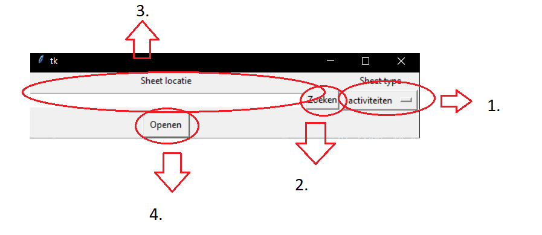
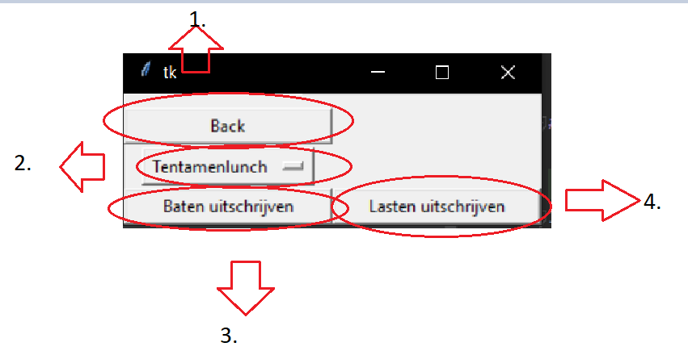

# Accountview_Typer

AV_Typer is een python tool om makkelijk excel data over te typen naar Accountview

## Installation
Installatie is erg eenvoudig. Download de dist folder. Als het gedownload is kan je het programma gebruiken door AV_Typer.exe te runnen

## Usage

1. *Type selectie:* Elke sheet (dus activiteiten, weekend en borrel) heeft een aparte indeling in excel. Om deze reden moet je bij het openen aangeven om welk type sheet het gaat. Als je de verkeerde sheet aangeeft werkt de tool niet, dus check dit eerst voordat je een bug report indiend!
2. *Zoeken:* Door op deze knop te drukken kan je een bestand op je laptop zoeken
3. *Locatie:* Hier komt de locatie van het geselecteerde excel workbook te staan. Je kan hier ook een locatie in typen/plakken
4. *openen:* Zodra je een workbook hebt geselcteerd kan je hierop drukken om naar de typsheet te gaan.

1. *Terug:* gebruik dit om een andere workbook te selecteren
2. *sheet selectie:* Gebruik dit om de sheet die je wilt uittypen te selecteren
3. *Baten uitschrijven:* Druk op deze knop om de baten uit de sheet uit te schrijven. De tool begint niet direct met typen maar wacht tot je op ',' drukt. De tool mag niet geminimaliseerd zijn als je dit doet. Je kan het typen op elk moment stoppen door op 'left-control' te drukken.
4. *Lasten uitschrijven:* Druk op deze knop om de lasten uit te schrijven. Voor meer infor zie baten

###Sheet types
Er zijn 4 sheet types
1. Activiteiten voor activiteitensheets
2. borrel voor borrel sheets
3. weekend voor weekend sheets
4. simpel voor sheets volgens een vast formaat. de contributie sheet werkt hier bijvoorbeeld ook mee.

## License
[MIT](https://choosealicense.com/licenses/mit/)